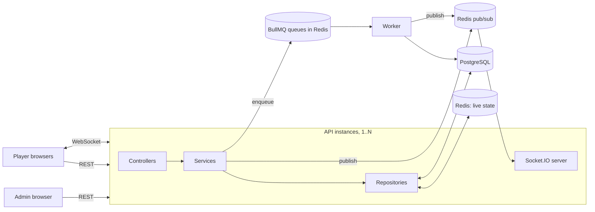
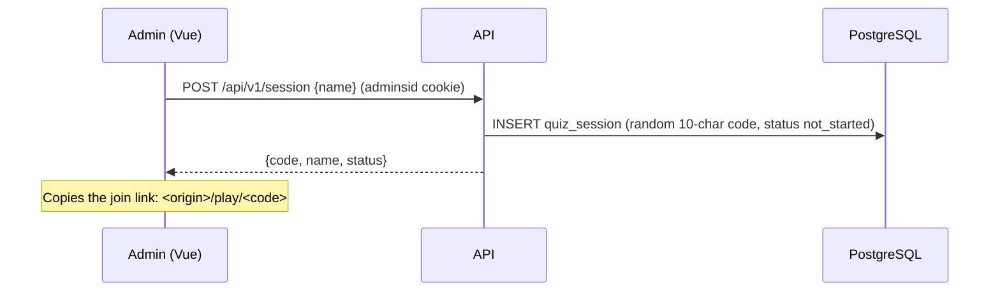
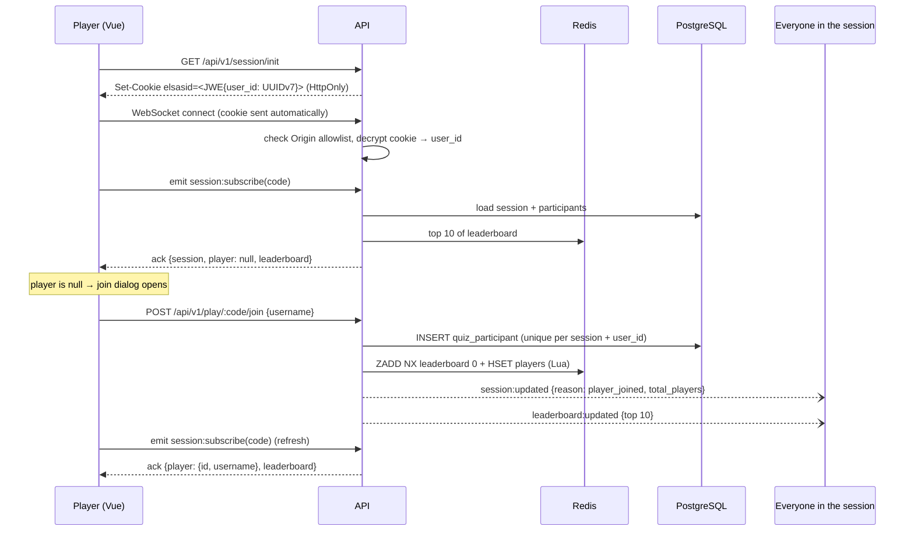
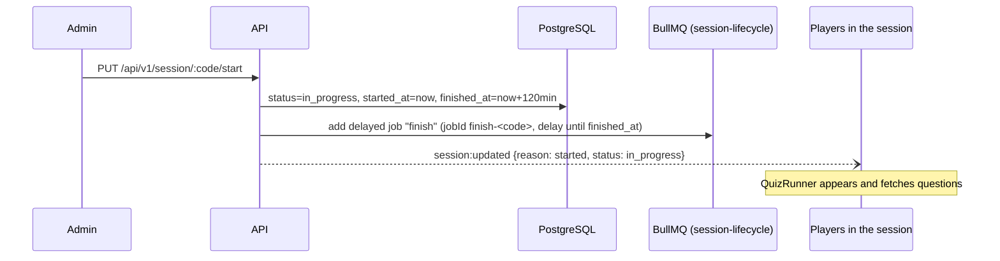
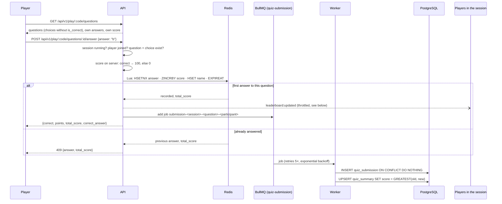
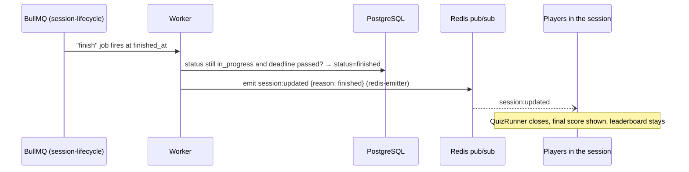

# Data Flow

How data moves through the system, from a player opening a join link to every screen showing the updated leaderboard. For setup and the component overview, see [README.md](./README.md).

## Overview

Two rules shape the design:

1. **During a game, Redis is the source of truth for answers and scores.** Every write a player makes is a single atomic Redis operation, so it stays fast and correct under concurrency.
2. **PostgreSQL is the durable record, written in the background.** The worker copies each scored answer from a queue into PostgreSQL. Retried or duplicated jobs are harmless.

Every broadcast goes through Redis pub/sub. That's why it doesn't matter which API instance a player is connected to, or which process caused the change (an API instance or the worker).

---

## 1. Admin creates a session

## 2. Player opens the join link and joins

- The page waits for `/session/init` before opening the socket, because the socket authenticates with that cookie.
- Refreshing the page subscribes again. The server finds the player in the session, so the join dialog doesn't come back.
- Broadcast snapshots carry counts and names, never `user_id`s.

## 3. Admin starts the session

Starting requires at least one participant and is rejected if the session has already started.

## 4. Player answers a question (the core loop)

### Why scores stay accurate and consistent

| Risk | How it's handled |
|---|---|
| Two submissions of the same question at once (double click, two tabs) | `HSETNX` and `ZINCRBY` run in **one Lua script**, so only the first one scores. Tested with 50 concurrent submissions. |
| Client claims it was correct | The client sends only the choice id. Correctness and points are decided on the server, and `is_correct` is never sent before answering. |
| Job retried, or delivered twice | `quiz_submission` has a unique `(session, question, participant)` key, so the insert does nothing the second time. The job id also deduplicates in BullMQ. |
| Jobs processed out of order | The summary stores `GREATEST(old, new)` running total, so an older job can never lower a score. |
| Queue unavailable when enqueuing | The player's answer still succeeds, because Redis already counted it. The failure is logged. |
| Answering outside the session window | Rejected unless `status = in_progress` and `now < finished_at`. |

### Leaderboard broadcast throttling

Each answer calls `scoreChanged(session)`. Per session and per API instance:

- the **first** change broadcasts immediately;
- further changes within **500 ms** are merged into **one** trailing broadcast.

A burst of 1,000 answers in one second costs about 2 broadcasts per instance. Every broadcast carries only the top 10, so its size doesn't grow with the number of players.

## 5. Session ends

The job only acts if the session is still running and its deadline has passed, so a retried or early job changes nothing. Even if the job runs late, the answer endpoint already rejects answers after `finished_at`.

## 6. Reconnects

If the connection drops, Socket.IO reconnects automatically, and the client sends `session:subscribe` again on every reconnect. Rooms don't survive a disconnect, so this matters. The reply carries the latest session snapshot, player and leaderboard, and the page catches up without a reload.

---

## Reference

### REST endpoints (`/api/v1`)

| Method & path | Auth | Purpose |
|---|---|---|
| `POST /auth/login` | none; rate limited 5/min | Admin login → `adminsid` cookie |
| `GET /auth/profile` | admin | Current admin |
| `GET /session` | admin | List sessions (paged, 10 per page) |
| `POST /session` | admin | Create a session |
| `PUT /session/:code/start` | admin | Start a session |
| `GET /session/init` | none | Issue the anonymous player cookie (`elsasid`) |
| `GET /play/:code` | none | Session details |
| `POST /play/:code/join` | player | Join with a username |
| `GET /play/:code/questions` | player, joined, running | Questions, own answers and own score |
| `POST /play/:code/questions/:questionId/answer` | player, joined, running | Submit one answer |

### Socket.IO events

| Direction | Event | Payload |
|---|---|---|
| client → server | `session:subscribe(code, ack)` | ack: `{ ok, session, player, leaderboard }` or `{ ok: false, error }` |
| server → client | `session:updated` | `{ reason: player_joined \| started \| finished, session }` |
| server → client | `leaderboard:updated` | `{ leaderboard: [{ rank, player_id, username, score }] }` |

The socket handshake requires a valid `elsasid` cookie and an allowed `Origin`. The contract is defined in `src/server/types/realtime.ts`.

### Redis keys

All keys for one session share the `{<sessionId>}` hash tag, so they land in the same Redis Cluster slot, which the Lua scripts require.

| Key | Type | Written by | Expires |
|---|---|---|---|
| `quiz:{id}:answers:<participantId>` | hash: questionId → choice | answer script | `finished_at` + 1 day |
| `quiz:{id}:leaderboard` | sorted set: participantId → score | join / answer scripts | `finished_at` + 1 day (7 days if nobody answers) |
| `quiz:{id}:players` | hash: participantId → username | join / answer scripts | same as the leaderboard |
| `player_session:<uuid>` | string | join | 1 year |
| `admin_session:<id>` | string | admin login | 1 day |
| `rate-limit:*` | | rate limiter | the rate-limit window |
| `bull:quiz-submission:*`, `bull:session-lifecycle:*` | | BullMQ | completed jobs kept for 1 hour, failed jobs for 7 days |
| `socket.io#*` | pub/sub channels | adapter / emitter | none (pub/sub, nothing stored) |
